# Diagrams

Mermaid diagrams of the system for the debrief. Companion to [REVIEW_GUIDE.md](REVIEW_GUIDE.md). GitHub, VS Code and most Markdown previewers render them.

## 1. Layers

Who is allowed to call whom. Arrows point from caller to callee, and nothing skips a layer.

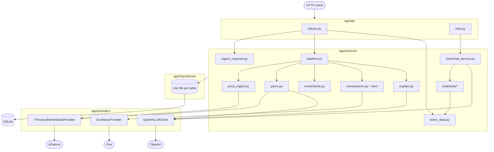

`app/dependencies.py` picks the concrete provider for each Protocol. Tests replace those three functions with fakes.

## 2. Ingest flow

`POST /tickers/{ticker}/ingest`, then the background task. Every database write happens on the pipeline thread. Only the Exa and OpenAI calls fan out.

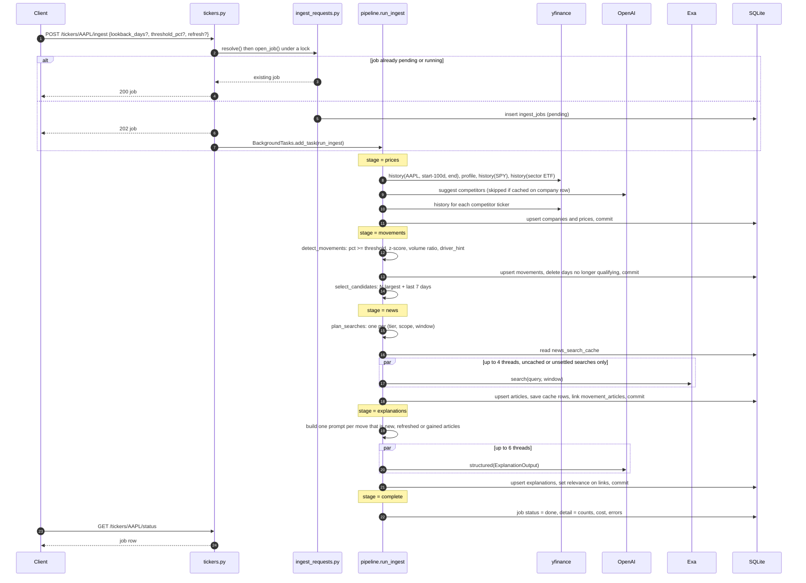

On any `AppError` the job is marked failed with the error's message. On any other exception the job says "Unexpected X. See the server log." Finished stages stay committed, so re-posting resumes at no cost.

## 3. Read flow

`GET /tickers/{ticker}` and its sub-resources. No outside calls.

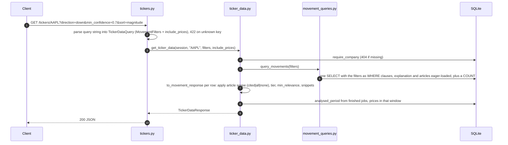

`/movements` and `/prices` are the same path without the other half. `/movements/{day}` uses fixed filters (all articles, with snippets).

## 4. Chat flow

`POST /chat`. The tools call the same `ticker_data.py` functions as the REST routes.

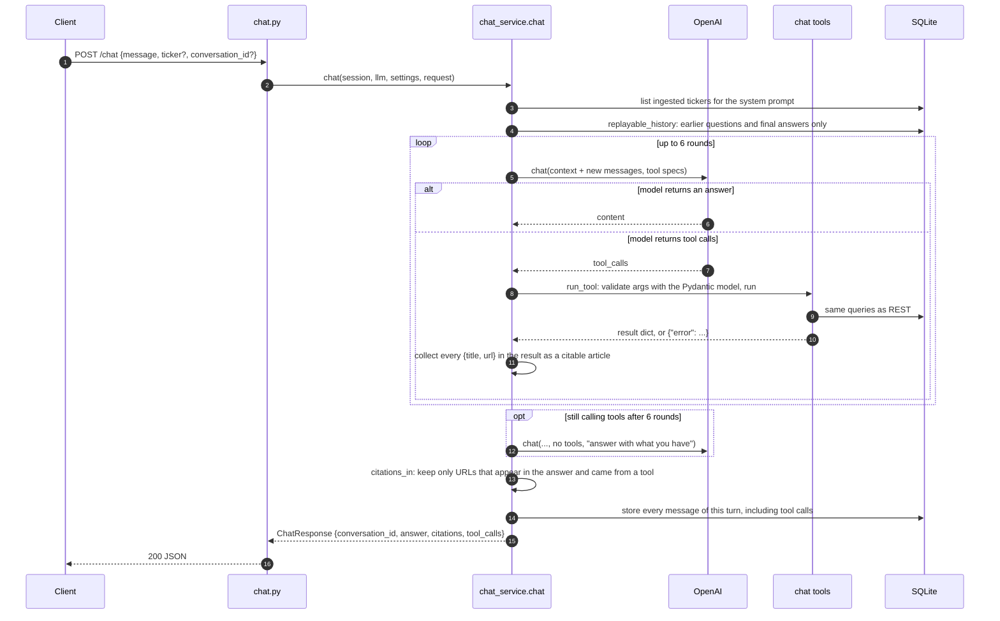

## 5. Ingest job lifecycle

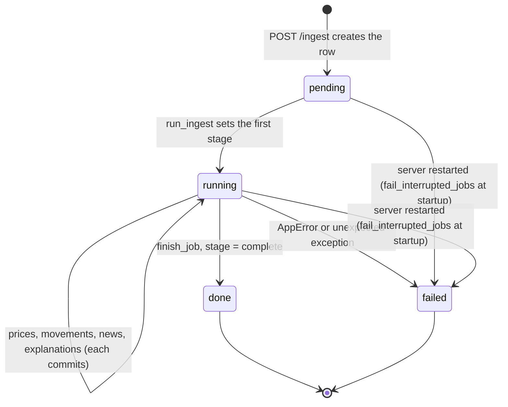

A pending or running job blocks a second ingest of the same ticker (the POST returns it with 200). Done and failed jobs do not.

## 6. Models

One SQLAlchemy class per file in `app/models/`. Types shown as stored in SQLite. Enum columns are plain strings.

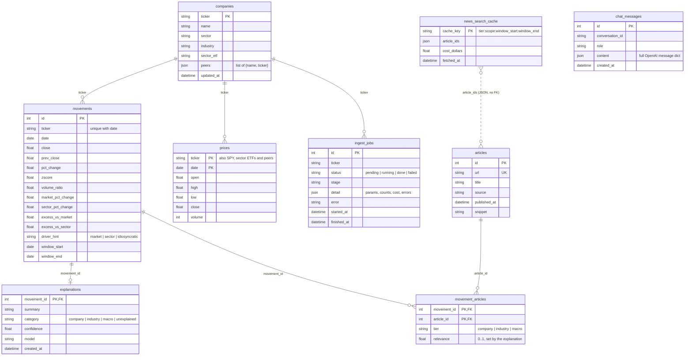

The `ticker` links to `companies` are by value, not declared foreign keys, because `prices` also holds benchmark and peer rows that have no company row.

## 7. Schemas

Pydantic models in `app/schemas/`. These are the serialisers: FastAPI validates input against the request models and output against the response models, and the LLM's structured output is parsed into the `llm` models.

### API request and response

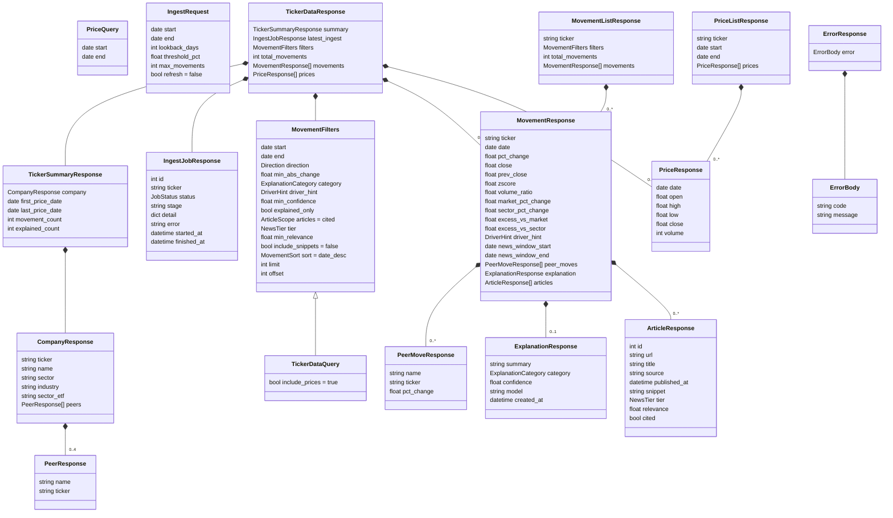

### Chat

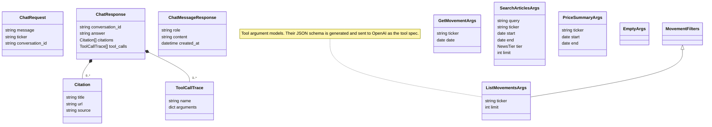

### LLM structured output

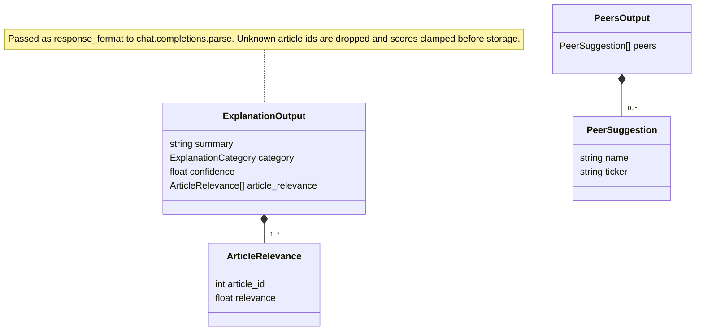

## 8. Protocols and strategy registries

The three seams where a fake or a new implementation drops in.

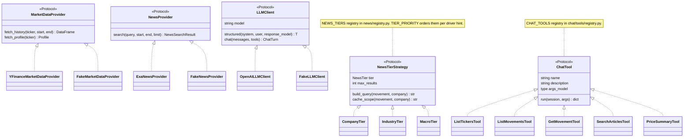

## 9. Errors

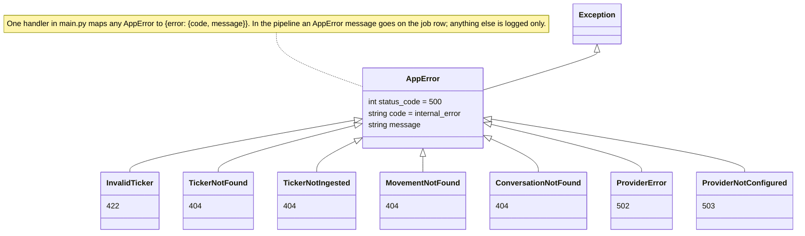

## 10. Driver hint decision

The price-only heuristic in `movements.driver_hint`. A benchmark explains a move when it went the same direction, moved at least 1% itself, and covers at least 40% of the stock's move.

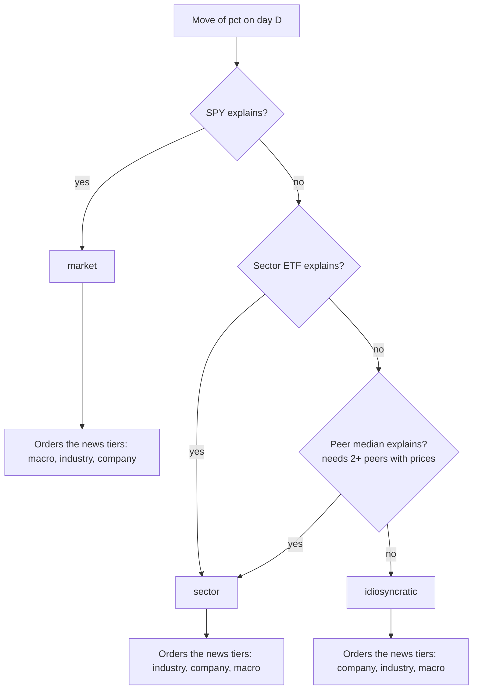

Every tier still runs. The hint sets the link order (an article found by two tiers keeps the first one's label) and goes into the explanation prompt as evidence.
